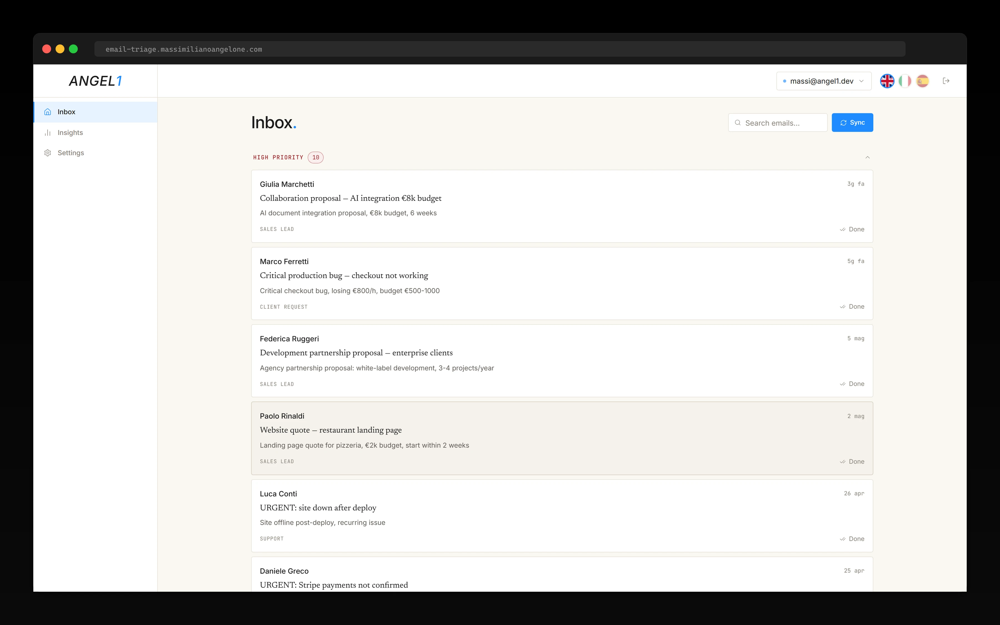
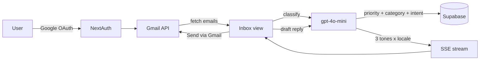

# Email Triage

AI inbox dashboard. Classifies every Gmail email by priority, category, urgency and intent, then drafts a reply in your tone of voice. Connects via OAuth, runs on Next.js and OpenAI.

**Live demo →** [email-triage.massimilianoangelone.com](https://email-triage.massimilianoangelone.com)

One-click *Enter demo* — no Google account required. Three pre-configured inboxes in Italian, English and Spanish.



## What it is

Connects to a Gmail account, fetches recent emails, classifies each one with a structured AI call (priority `high|medium|low|spam`, category, urgency in hours, sender intent, one-line summary), and produces a drafted reply on demand in three tones — professional, friendly, formal — across three locales. Send-via-Gmail emits proper SMTP threading headers (`In-Reply-To`, `References`) so the reply continues the thread in Outlook and Apple Mail, not just in Gmail.

## Features

- **Multi-account Gmail** — three pre-configured inboxes in the demo (IT/EN/ES), with locale-aware classification and reply suggestions
- **Pre-generated reply matrix** — 60 emails × 3 locales × 3 tones = 540 replies baked once at $0.23 total, served via SSE at runtime cost zero
- **Editable subject with thread integrity** — `Re:` prepended idempotently, `In-Reply-To` and `References` headers preserved so threading survives across mail clients
- **Per-account classification rules** — `from_contains → priority` overrides stored in a JSON map in `users_settings`, applied after the AI pass
- **Cost-pinned model** — `gpt-4o-mini-2024-07-18` hard-coded in both `classify.ts` and `suggest-reply.ts`, structured cost logging per call
- **Mock mode** — four env flags run the app fully offline, no Google or OpenAI key required

## Stack

```
Framework    Next.js 16 (App Router) + React 19 + TypeScript strict
Auth         NextAuth v4 (Google OAuth + Gmail scopes, JWT session)
Database     Supabase (Postgres) — service-role queries in mock mode
AI           OpenAI gpt-4o-mini-2024-07-18 (classification + reply)
Mail         Gmail API (read + send with thread headers)
UI           Tailwind CSS v4 + Base UI + framer-motion
Charts       Recharts
i18n         Custom locale provider (en / it / es)
Tests        Vitest (unit) + Playwright (e2e)
Hosting      Vercel
```

## Architecture



In demo mode, every step bypasses external calls: the 60 emails come from a seeded `emails_mock` table, classifications are pre-stored, and replies stream from a pre-generated `ai_suggested_replies` JSONB column with chunked SSE delivery so the perceived UX matches a real AI call.

## Run locally

```bash
git clone https://github.com/maxange-developer/email-triage.git
cd email-triage
pnpm install
cp .env.example .env.local
```

**Zero-config offline mode** — flip these four flags and skip Google + OpenAI setup:

```bash
USE_MOCK_AUTH=true
USE_MOCK_AI=true
USE_MOCK_DATA=true
NEXT_PUBLIC_USE_MOCK=true
```

```bash
pnpm demo:seed   # populates Supabase with 60 demo emails, 3 mock accounts, 540 reply variants
pnpm dev         # http://localhost:3000 -> click "Enter demo"
```

For real Gmail integration, set the four flags to `false` and provide `OPENAI_API_KEY`, `GOOGLE_CLIENT_ID`, `GOOGLE_CLIENT_SECRET`, plus Supabase keys. The hidden `/login/dev` route exposes the OAuth flow.

## Project structure

```
src/
  app/
    api/                 Route handlers (classify, suggest-reply, send)
    app/                 Authenticated dashboard
    login/               Auth pages incl. /login/dev for OAuth testing
  components/
    dashboard/           Layout shell, sidebar
    email-detail/        Single email view + AI panels
    inbox/               Email list, filters, search
    insights/            Recharts analytics
    settings/            Per-account rules editor
    ui/                  Base UI primitives
  contexts/              AccountContext for multi-account state
  i18n/                  Client-side locale provider (it/en/es)
  lib/
    ai/                  classify + suggest-reply (OpenAI)
    auth/                NextAuth config + session helpers
    db/                  Supabase queries
    gmail/               Gmail API (fetch, parse, send w/ headers)
    mock/                Offline fixtures
    supabase/            Client + service-role factories
    types/               Shared TS types
    utils/               buildReplySubject, email-locale, logger
    validations/         Zod schemas
scripts/                 demo-data export/seed/audit
supabase/migrations/     Database schema (001 -> 006)
tests/
  unit/                  Vitest
  e2e/                   Playwright
```

## Cost

Generating the demo dataset (translations + 3-tone reply matrix for 60 emails) cost ~$0.23 in total via `gpt-4o-mini`. After the one-time dump in `scripts/demo-data.json`, the demo runs at zero cost.

Real usage: ~$0.0003 per email (classification + one reply drafted). Detail: [docs/COST_ESTIMATES.md](docs/COST_ESTIMATES.md).

## Scope

Email Triage was built as a portfolio engagement to demonstrate Gmail OAuth integration, structured AI classification, and locale-aware UX end-to-end. The live demo runs on three mock Gmail accounts with 60 pre-seeded emails and 540 pre-generated reply variants — no real Gmail account or OpenAI key required. The cost figures reflect the one-time demo generation; runtime cost in demo mode is zero. The [case study](https://massimilianoangelone.com/work/email-triage) captures the architectural reasoning end-to-end.

## License

MIT.

## Author

Built by [Massimiliano Angelone](https://massimilianoangelone.com) — AI-Enhanced MVP Developer, Tenerife.
